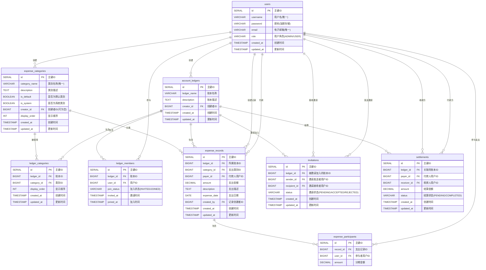

```mermaid
erDiagram
%% 用户表
users {
SERIAL id PK "主键ID"
VARCHAR username "用户名(唯一)"
VARCHAR password "密码(加密存储)"
VARCHAR email "电子邮箱(唯一)"
VARCHAR role "用户角色(ADMIN/USER)"
TIMESTAMP created_at "创建时间"
TIMESTAMP updated_at "更新时间"
}

    %% 账本表
    account_ledgers {
        SERIAL id PK "主键ID"
        VARCHAR ledger_name "账本名称"
        TEXT description "账本描述"
        BIGINT creator_id FK "创建者ID"
        TIMESTAMP created_at "创建时间"
        TIMESTAMP updated_at "更新时间"
    }

    %% 支出类别表
    expense_categories {
        SERIAL id PK "主键ID"
        VARCHAR category_name "类别名称(唯一)"
        TEXT description "类别描述"
        BOOLEAN is_default "是否为默认类别"
        BOOLEAN is_system "是否为系统类别"
        BIGINT creator_id FK "创建者ID(可为空)"
        INT display_order "显示顺序"
        TIMESTAMP created_at "创建时间"
        TIMESTAMP updated_at "更新时间"
    }

    %% 账本类别关联表
    ledger_categories {
        SERIAL id PK "主键ID"
        BIGINT ledger_id FK "账本ID"
        BIGINT category_id FK "类别ID"
        INT display_order "显示顺序"
        TIMESTAMP created_at "创建时间"
        TIMESTAMP updated_at "更新时间"
    }

    %% 账本成员表
    ledger_members {
        SERIAL id PK "主键ID"
        BIGINT ledger_id FK "账本ID"
        BIGINT user_id FK "用户ID"
        VARCHAR join_status "加入状态(INVITED/JOINED)"
        TIMESTAMP invited_at "邀请时间"
        TIMESTAMP joined_at "加入时间"
    }

    %% 支出记录表
    expense_records {
        SERIAL id PK "主键ID"
        BIGINT ledger_id FK "所属账本ID"
        BIGINT category_id FK "支出类别ID"
        BIGINT payer_id FK "付款人用户ID"
        DECIMAL amount "支出金额"
        TEXT description "支出描述"
        DATE expense_date "支出日期"
        BIGINT created_by FK "记录创建者ID"
        TIMESTAMP created_at "创建时间"
        TIMESTAMP updated_at "更新时间"
    }

    %% 支出参与者表
    expense_participants {
        SERIAL id PK "主键ID"
        BIGINT record_id FK "支出记录ID"
        BIGINT user_id FK "参与者用户ID"
        DECIMAL amount "分摊金额"
    }

    %% 邀请通知表
    invitations {
        SERIAL id PK "主键ID"
        BIGINT ledger_id FK "被邀请加入的账本ID"
        BIGINT sender_id FK "邀请发送者用户ID"
        BIGINT recipient_id FK "邀请接收者用户ID"
        VARCHAR status "邀请状态(PENDING/ACCEPTED/REJECTED)"
        TIMESTAMP created_at "创建时间"
        TIMESTAMP updated_at "更新时间"
    }

    %% 结算记录表
    settlements {
        SERIAL id PK "主键ID"
        BIGINT ledger_id FK "关联的账本ID"
        BIGINT payer_id FK "付款人用户ID"
        BIGINT receiver_id FK "收款人用户ID"
        DECIMAL amount "结算金额"
        VARCHAR status "结算状态(PENDING/COMPLETED)"
        TIMESTAMP created_at "创建时间"
        TIMESTAMP updated_at "更新时间"
    }

    %% 关系定义
    users ||--o{ account_ledgers : "创建"
    users ||--o{ expense_categories : "创建"
    users ||--o{ ledger_members : "参与"
    users ||--o{ expense_records : "付款"
    users ||--o{ expense_records : "创建记录"
    users ||--o{ expense_participants : "参与支出"
    users ||--o{ invitations : "发送邀请"
    users ||--o{ invitations : "接收邀请"
    users ||--o{ settlements : "付款方"
    users ||--o{ settlements : "收款方"

    account_ledgers ||--o{ ledger_categories : "包含"
    account_ledgers ||--o{ ledger_members : "包含"
    account_ledgers ||--o{ expense_records : "包含"
    account_ledgers ||--o{ invitations : "邀请加入"
    account_ledgers ||--o{ settlements : "结算"

    expense_categories ||--o{ ledger_categories : "被使用"
    expense_categories ||--o{ expense_records : "分类"

    expense_records ||--o{ expense_participants : "包含"
```